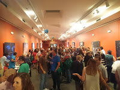
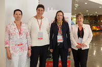
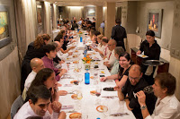

---
authors:
- admin
categories: [Investigación, Marketing, ]
date: 2015-09-30T08:26:17+02:00
draft: false
featured: false
image:
  caption: ""
  focal_point: "Center"
projects: [ ]
subtitle: Una gran experiencia
title: "Cierre Congreso Aemark2015"
tags: [Investigación, Marketing, ]
---

Durante los días 9, 10 y 11 de septiembre hemos podido disfrutar de la presencia de casi 200 colegas de marketing procedentes de universidades españolas y latinoamericanas.

El Congreso, organizado por [AEMARK](http://www.aemark.es/) junto con el comité local, ha celebrado su XXVII Edición.

Tener la oportunidad de participar en el comité local ha supuesto todo un reto este año. Los aspectos administrativos de la organización están alejados de las habilidades que requiere nuestra tarea académica habitual. Sin embargo, podemos valorar muy positivamente la experiencia. Tanto las lecciones aprendidas como, sobre todo, la oportunidad de estar en contacto con tantos compañeros durante el proceso de envío de comunicaciones, revisión, inscripciones y finalmente el congreso han merecido la pena sin duda. Los tres días del congreso han sido la feliz culminación de todo un año de trabajo, así que no me resisto a explicar en esta entrada en qué ha consistido el congreso.

### Doctoral Colloquium

El miércoles 9 de septiembre, antes de la inauguración oficial del congreso, se celebró el primer Doctoral Colloquium de Aemark, en el que nueve estudiantes de doctorado pudieron compartir sus propuestas y recibir comentarios de investigadores "senior". Hasta el momento, en el área de marketing no existía un coloquio de este tipo en España. Los Doctoral Colloquium son una vía estupenda para recibir feed-back muy valioso de investigadores veteranos, además de servir para establecer relaciones con otros doctorandos en la misma situación.

Tras el colloquium, tuvo lugar la apertura del congreso y una recepción en el [Planetario](http://pamplonetario.org/) de Pamplona (Pamplonetario). Parece mentira, pero ha sido la primera vez que he podido conocer las estrellas que se ven el el cielo nocturno de Pamplona.

### Jueves, 10 de septiembre

El jueves empezamos el día con mal pie. Pese a las pruebas técnicas previas, en el momento del estreno ¡nada funciona! Pasado el pánico inicial y tras superar los problemas con las versiones del software de los portátiles, conexiones con los cañones etc... tuvimos un primer grupo de sesiones paralelas y, tras la pausa, la **sesión con los editores**. Este año, los invitados eran  Gita V. Johar,  editora del [**Journal of Consumer Research**](http://www.ejcr.org/), Constantine S. Katsikeas, editor del[ **Journal of International Marketing**](https://www.ama.org/publications/JournalOfInternationalMarketing/Pages/current-issue.aspx) y Shintaro Okazaki, editor del[ **Journal of Advertising**](http://www.tandfonline.com/loi/ujoa20#.VfqPoJfNI-o).

En las sesiones paralelas presentamos dos trabajos: "Creación de satisfacción y lealtad en nuevos canales : Private sales clubs" y "Fuentes de información y compra en los servicios de experiencia y creencia".

Por la tarde, dos novedades: una sesión de póster (habitual en otros congresos pero nueva en Aemark) y una sesión profesional en la que [Esmeralda Díaz Aroca](http://www.esmeraldadiazaroca.com/) nos habló de **Personal Branding y Carlos Mínguez de GfK** compartió algunas nuevas tendencias en **Investigación de Mercados** como el impacto del "Smart Data" tanto en las metodologías de recogida de información como en el análisis.

 Para terminar la jornada, como no podía ser de otra manera en Pamplona, **Juevintxo** en el Casco Viejo.

### Viernes, 11 de septiembre

El viernes no podía ser menos intenso: tras una primera tanda de sesiones paralelas, Gita V. Johar ofreción la conferencia invitada, en la que introdujo en concepto de "Caracterización egocéntrica" y describió los[ experimentos](https://scholar.google.es/scholar?hl=es&q=Johar+egocentric&btnG=&lr=) que han realizado en torno a esta idea. **¿Nos definimos por las cosas que poseemos o las cosas que poseemos nos definen?** Los conceptos que maneja son realmente provocadores y abren caminos de investigación con un impacto potencial en el marketing B2C importante.

Antes de comer, momento importante y emotivo con la entrega del **Premio a la Trayectoria** a Ignacio Cruz Roche. 

Y tras otra tanda de sesiones paralelas, llegó la sesión de clausura y la [entrega de premios](http://www.aemarkcongresos.com/congreso2015/es/galeria/fotos/galeria-fotografica-viernes-11-clausura-y-cena). ¡Enhorabuena a todos! 

Para terminar con buen pie, cena en el [Hotel Europa.](http://www.hreuropa.com/)

En la [página del congreso](http://www.aemarkcongresos.com/congreso2015/es/) se pueden consultar los documentos de todas la comunicaciones presentadas, así como muchísimas más fotos.

**¡Y el año que viene, nos iremos a León!**

###  

###  