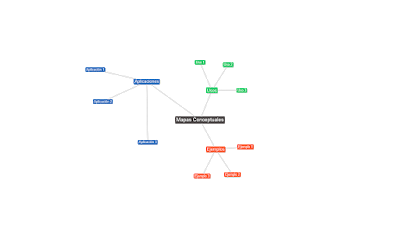

---
authors:
- admin
categories: [Herramientas 2.0, Recursos Educativos]
date: 2016-10-16T08:26:17+02:00
draft: false
featured: false
image:
  caption: "Photo by Jakob Braun on Unsplash"
  focal_point: "Center"
projects: [ ]
subtitle: Los mapas conceptuales como herramienta docente  
title: "Mapas Conceptuales"
tags: [Herramientas 2.0, Recursos Educativos]
---

### Los mapas conceptuales como herramienta docente

Los mapas conceptuales son una herramienta útil para mostrar a los estudiantes la interrelación entre distintos términos. Podemos, por supuesto, elaborar el mapa en la pizarra pero existen algunas aplicaciones que nos permiten hacerlo directamente en la web de forma colaborativa.

Vamos a repasar algunas de ellas.

### Editores orientados a la creación de imágenes

#### Text2Mindmap

[Text2mindmap](http://www.text2mindmap.com/) es una aplicación muy muy sencilla que permite crear mapas de manera muy rápida. Solo con pegar una lista de palabras indentada, nos mostrará automáticamente el mapa que podremos después retocar. Como contrapartida, en su versión gratuita, no se puede interactuar con los mapas y está pensado simplemente para descargarlos posteriormente como imagen.

#### Gliffy

[Gliffy](https://www.gliffy.com/)  es una herramienta muy potente para dibujar mapas mentales así como para hacer gráficos de todo tipo. Es totalmente gratuita y está orientada (al igual que Text2Mindmap) a la creación de imágenes, pero es mucho más potente que la primera y permite la inclusión de imágenes y enlaces. Como contrapartida, es más compleja de utilizar y, por tanto, exige dedicarle más tiempo.

### Editores orientados a la creación de mapas interactivos

Existen otras herramientas cuyo objetivo específico es crear mapas en los que se puede colaborar en tiempo real, por lo que profesor y estudiantes pueden elaborar y modificar los mapas de forma colaborativa. ¿Genial, no? Entre ellas, destacan [Mindomo](https://www.mindomo.com/), [Bubbl.us](https://bubbl.us/) o [Mindmeister](https://www.mindmeister.com/). La mala noticia es que en su modalidad gratuita solo permiten guardar tres mapas. La buena es que tienen planes educativos bastante asequibles.

<iframe allowfullscreen="" frameborder="0" height="400" src="https://www.mindomo.com/mindmap/material-visual-cad2decf2a1d4f9daddc20df6a8af0e7" width="400">Your browser does not support frames. View this <a href="https://www.mindomo.com/mindmap/material-visual-cad2decf2a1d4f9daddc20df6a8af0e7" target="_blank">mind map</a> on its original site. It was created using <a href="https://www.mindomo.com" target="_blank">Mindomo</a> mind mapping software.</iframe>

Una muy buena alternativa es [Wisemapping](http://www.wisemapping.com/). En este caso hablamos de una herramienta totalmente gratuita, con casi todas las prestaciones de las anteriores, salvo la posibilidad de incluir imágenes.

<iframe src="https://app.wisemapping.com/c/maps/311767/embed?zoom=1" style="border: 1px solid black; height: 400px; width: 600px;"> </iframe>

¡Espero que la información os haya resultado útil!

