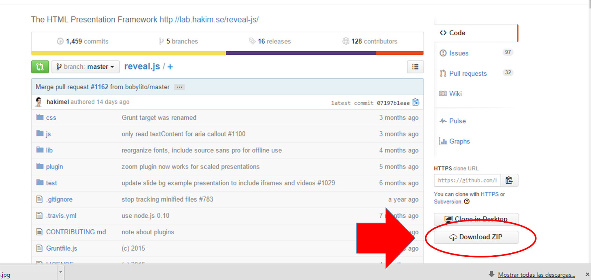
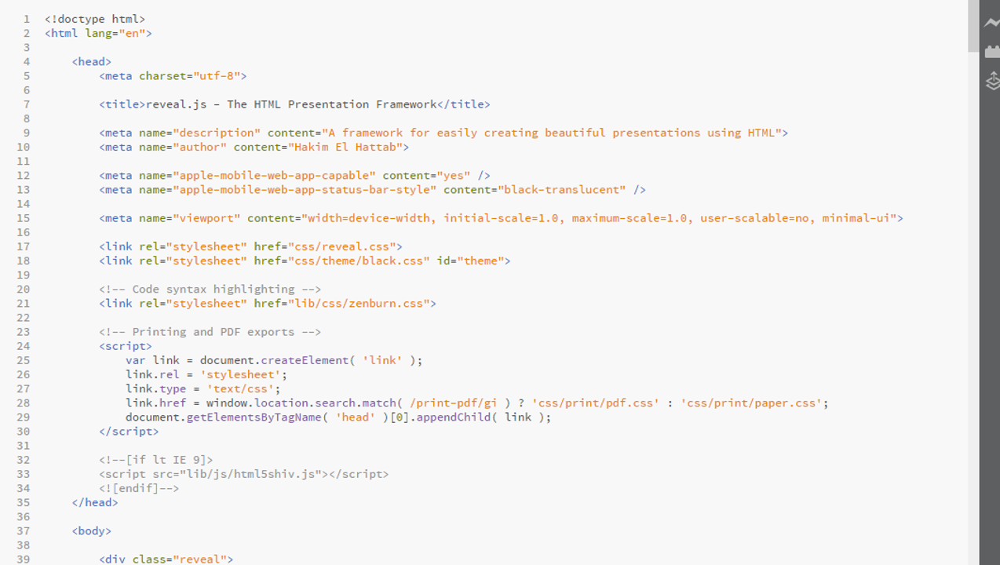
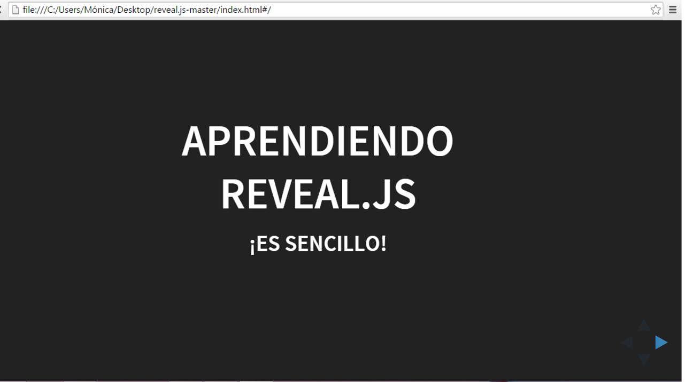

---
authors:
- admin
categories: [Presentaciones, Reveal.js, ]
date: 2015-04-26T08:26:17+02:00
draft: false
featured: false
image:
  caption: ""
  focal_point: ""
projects: []
subtitle: Cómo empezar
title: "Presentaciones en HTML con Reveal.js"
tags: [Presentaciones, Reveal.js, ]
---

Hoy voy a profundizar un poco en esa herramienta para hacer presentaciones en HTML que os presentaba en [esta entrada](../muerte-por-power-point/index.html). Podéis ver un ejemplo de cómo queda una presentación de este estilo:

```{r}
knitr::include_url('https://revealjs.com/#/')
```

Navegamos con las teclas o con el ratón, podemos pulsar la tecla F para pasar a pantalla completa, B para poner la pantalla en negro y ESC para ver el esquema de la presentación.

## Cómo empezar

### Descarga de los archivos necesarios

Para comenzar a utilizar reveal.js no es necesario instalar ningún software, ya que será el propio navegador que utilicemos (preferentemente Chrome, pero también Safari, Firefox e Internet Explorer) el que interprete los archivos que iremos creando. Vamos por pasos:

Lo primero que tenemos que hacer es descargar una carpeta desde [Github](https://github.com/hakimel/reveal.js/):



Descomprimimos la carpeta en el directorio que queramos y ya podemos empezar a trabajar.Esta carpeta ya es una presentación. El archivo que contiene el texto de la presentación se llama index.html y tiene que tener siempre ese nombre para poder presentar:


## Creando la presentación


Si hacemos dobre click en ese fichero, podemos ver como se abrirá en el navegador y veremos la presentación de ejemplo. El resto de archivos en la carpeta sirven para que el navegador pueda interpretar correctamente el archivo HTML. En general, cuando vamos a hacer una presentación nueva, **debemos copiar toda la carpeta y editar el archivo index.html**.

Antes de editar el archivo, es buena idea hacer una copia y renombrarlo por si queremos recuperar el archivo original.

Podemos editar el archivo directamente con el bloc de notas, pero resulta un poco incómodo. Cualquier editor de HTML nos servirá, yo tengo instalado [Brackets](http://brackets.io/). Si seleccionamos el archivo index.html y elegimos la opción "abrir con..." veremos algo similar a esto:



¡Que nadie se asuste! Es más simple de lo que parece. 

En este documento se distinguen **tres partes**. La **primera parte** va desde la primera línea hasta donde pone:

```
</head>
```

Esta es la **introducción de la presentación**, en la que normalmente no debemos tocar nada, salvo los campos correspondientes al título y al autor, que son:

```
<title>reveal.js - The HTML Presentation Framework</title>

<meta name="description" content="A framework for easily creating beautiful presentations using HTML">

<meta name="author" content="Hakim El Hattab">
```

Aquí tendríamos que sustituir los valores por defecto por nuestros propios datos.

### Creando transparencias

La presentación como tal empieza exactamente tras estas líneas:

```
<div class="reveal"> 
<!-- Any section element inside of this container is displayed as a slide -->
<div class="slides">
```

A partir de ahí, estamos en la **segunda parte del documento**, la presentación como tal. Vemos una serie de instrucciones separadas por las etiquetas `<slide></slide>:`


Cada serie <slide></slide> es una transparencia. Ahora solo tenemos que sustituir el texto creado por el autor, por nuestro propio texto. Por ejemplo, si cambiamos:
```
<section>

<h1>Reveal.js</h1>
<h3>The HTML Presentation Framework</h3>
<p>
<small>Created by <a href="http://hakim.se">Hakim El Hattab</a> / <a href="http://twitter.com/hakimel">@hakimel</a></small></p></section>
```

por:

```
<section>
<h1>Aprendiendo Reveal.js</h1>
<h3>¡Es sencillo!</h3>
</section>
```

guardamos, y abrimos el index.html con el navegador, esto es lo que vemos:



A partir de ahí, solo tenemos que ir copiando y pegando estas lineas de texto para ir añadiendo transparencias.

### Tercera parte

Nos queda pendiente hablar de la **tercera parte** del archivo index.html. Esta tercera parte es indispensable para que la presentación funcione y normalmente debemos tocarla con cuidado o dejarla directamente tal cual. Empieza justo después del último `</section>`:


Esta parte del archivo carga los plugins necesarios para el funcionamiento de la presentación.

### Presentar

Tras editar todas las transparencias que necesitemos, necesitaríamos guardar **toda la carpeta** en un pendrive o subirla a un servidor para hacer la presentación.

Y hasta aquí la introducción. Otro día hablaremos de transparencias anidadas verticalmente, de imágenes y enlaces y de cambios en el diseño de la plantilla.

¿Qué os ha parecido? ¿Os animáis a probar?¿Ya eres un experto?


  