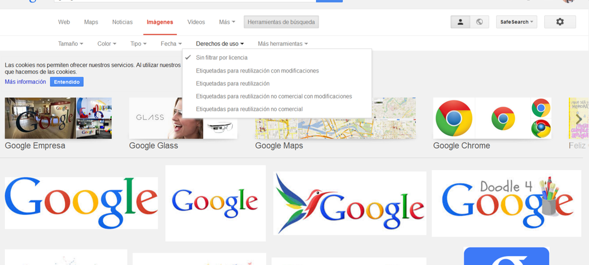

---
authors:
- admin
categories: [Blogs, Herramientas 2.0, Presentaciones]
date: 2017-04-28T08:26:17+02:00
draft: false
featured: false
image:
  caption: "Photo by Giulia May on Unsplash"
  focal_point: "Center"
projects: []
subtitle: Bancos de imágenes y herramientas
title: "Recursos para presentaciones y blogs (I) "
tags: [Blogs, Herramientas 2.0, Presentaciones]
---

### Recursos gráficos

Ya sea para una entrada en un blog, una presentación con transparencias o una página web, la utilización de imágenes es casi imprescindible.

Ahora bien, ¿de dónde sacamos estas imágenes? Más allá de una búsqueda en Google Images, en esta entrada quiero repasar fuentes y recursos para **encontrar imágenes** atractivas y de calidad y algunas **herramientas de edición**.  En la siguiente entrada repasaré opciones para diseñar **nuestros propios recursos**.

### Fuentes de imágenes de uso libre

Un aspecto fundamental a la hora de utilizar imágenes ajenas es asegurarnos de no estar incumpliendo los derechos de propiedad intelectual de los autores. Por eso, si vamos a utilizar **Google Imágenes** como buscador, una buena práctica es acostumbrarse a utilizar la opción "Derechos de Uso" dentro de "Herramientas de Búsqueda":

Sin embargo, si necesitamos imágenes atractivas y de calidad, hay otras fuentes que pueden proporcionar recursos de mayor calidad. La primera opción es [flickr](https://www.flickr.com/), donde podemos hacer una búsqueda de imágenes con licencia Creative Commons. Además, existen **bancos de imágenes** de uso libre donde podemos encontrar fotos impresionantes. A continuación, os dejo los enlaces de los que más utilizo:

[Jay Mantri](http://jaymantri.com/)

[Start Up Stock Photos](http://startupstockphotos.com/)

[Unsplash](https://unsplash.com/)

Podemos utilizar también **buscadores de bancos de imágenes**:

[Stock Snap](https://stocksnap.io/)

[Morguefile](https://www.morguefile.com/)

[Pixabay](https://pixabay.com/en/)

[Pexels](https://www.pexels.com/)

[Stock Up](https://www.sitebuilderreport.com/stock-up)

Como veis, los recursos son infinitos ¡ahora no hay excusas para no usar buenas fotos!

Si lo que buscamos, no es una imagen sino un **dibujo o icono** también tenemos grandes opciones:

[flaticon](http://www.flaticon.com/)

[freepic](http://www.freepik.com/free-vectors/icons)

[IconArchive](http://www.iconarchive.com/commercialfree.html)

Como podéis ver, podemos encontrar recursos gráficos mucho mejores que, por ejemplo, las imágenes prediseñadas de Office.

[Love vector designed by Freepik](https://www.freepik.com/free-photos-vectors/love)

### Recursos de edición

> Vale, ya tengo mi imagen, pero no es exactamente lo que quiero...

Una vez seleccionada una imagen, a veces necesitamos hacer algunas modificaciones. Si vamos a utilizar la imagen en una página web,siempre es recomendable **optimizarla** para que no ralentice la carga de la página. [Web Resizer](http://webresizer.com/resizer/) hace exactamente eso de forma rápida y sencilla.

Otras veces, no nos gusta demasiado el fondo de la imagen o queremos destacar una determinada parte, recortar o cambiar el tamaño. Podemos utilizar Adobe Photoshop u otros programas pero también disponemos de herramientas web que permiten esta **edición rápida** sin necesidad de ninguna instalación y de forma muy sencilla e intuitiva. Entre todas las opciones, a mi me gustan especialmente dos:

[pixrl.com](https://pixlr.com/) permite hacer todas estas cosas en un tiempo récord. Por ejemplo, utilizando la herramienta focal en la imagen anterior, en menos de treinta segundos, podemos obtener esto:

[PicMonkey](http://www.picmonkey.com/) es otra herramienta muy popular. En este caso hay bastantes opciones que son de pago, pero las funciones gratuitas nos permiten dar rápidamente un aire nuevo a una imagen:

Con estas herramientas será suficiente para la mayoría de los casos. Sin embargo, si queremos ir un paso más allá y diseñar imágenes con nuestros propios textos, gráficos o infogramas, hay otras opciones más adecuadas a las que dedicaré la siguiente entrada.

¿Y tú, dónde encuentras las imágenes que utilizas?¿Usas herramientas de edición? 