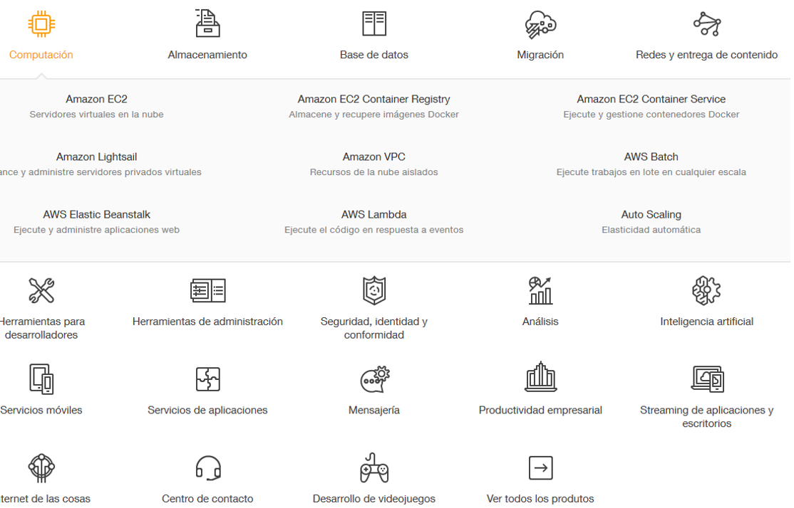
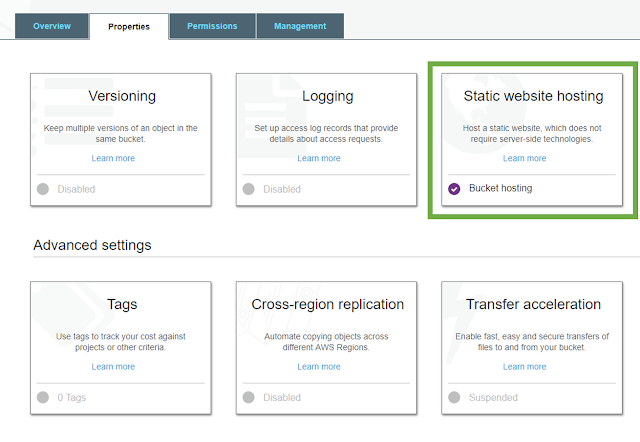

---
authors:
- admin
categories: [Docencia, Dropbox, Herramientas 2.0, Investigación, Reveal.js]
date: 2017-07-03T08:26:17+02:00
draft: false
featured: false
image:
  caption: ""
  focal_point: "Center"
projects: []
subtitle:  Amazon Web Services
title: "Probando el hosting de Amazon S3"
tags: [Docencia, Dropbox, Herramientas 2.0, Investigación, Reveal.js]
---

## Porqué probar el hosting de Amazon

### El cambio en las condiciones de servicio de Dropbox

Estoy encantada con el servicio de [Dropbox](https://www.dropbox.com/es_ES/). He probado distintos servicios de almacenamiento en la nube y, en mi opinión, Dropbox además de ser fiable, es el más cómodo con diferencia.

Además, una de las características que les diferenciaba de la competencia y que era muy importante para mi, era la posibilidad de alojar páginas web estáticas sin hacer nada más que simplemente dejar los archivos necesarios en una carpeta denominada "Public". Esta opción era sumamente útil para presentaciones en html como las realizadas con [reveal.js](https://mcrecursosdocentes.blogspot.com.es/search/label/Reveal.js). Podía trabajar localmente en la presentación y cada pequeño cambio era visible en una url pública.

Lamentablemente ya hace un año que Dropbox anunció el cese del servicio, de forma que, aunque los archivos seguirán "en la nube", ya no será accesibles como web, sino como un simple archivo de texto. Los usuarios gratuitos perdieron esta opción hace un año, y para los usuarios premium, el cambio tendrá efecto el 1 de septiembre.

Uno de los aspectos atractivos de hacer una presentación en html es precisamente que esté disponible en la web y no dependa de un pincho para funcionar, así que era necesario buscar alternativas.

## Amazon Web Services

En mi caso, necesitaba un servicio:

\1. **Múltiple:** Que permita alojar "muchas" webs diferentes (una para cada presentación)

\2. **Barato:** de momento no me interesa pagar por alojar mis presentaciones

\3. **Simple:** el hecho de alojar la presentación va a ser un trabajo adicional al propio hecho de prepararla y, dado que muchas veces (más de las debidas) suelo ir con el tiempo muy justo, no quiero añadir trabajo adicional.

En el caso de AWS, la opción gratuita es interesante para este tipo de uso, ya que proporciona 5 GB y un número limitado de solicitudes. Como mis presentaciones no suelen tener provocar solicitudes de descargas masivas, la opción inicial es más que suficiente, así que el requisito "barato" está más que cumplido.

Con respecto al requisito "múltiple" tampoco es un problema, ya que podemos tener tantas páginas como queramos siempre que se cumpla el requisito de espacio y de solicitudes.

Por último, con respecto a lo simple, inicialmente AWS son un poco intimidantes. En la siguiente imagen vemos un subconjunto de los servicios ofrecidos:

> Confieso que términos como "AWS Elastic Beanstalk" me suenan totalmente a chino.

Sin embargo, una vez localizado el servicio necesario, Amazon S3, el proceso ha sido sorprendentemente sencillo.

## Amazon S3

El espacio en Amazon S3 se organiza en compartimentos llamados *"buckets"*. Cada "bucket" es un contenedor autónomo que podemos gestionar de forma diferente. 

### ¿Cómo subimos los archivos?

La subida de archivos se gestiona con una consola online en la que con un sencillo sistema tipo "drag and drop" podemos subir los archivos necesarios. También podemos automatizar el proceso operando desde la consola de comandos pero de momento, la interfaz online es suficiente para mi.

### ¿Cómo se configura un "bucket" para que funcione como una web?

Una vez subidos los archivos, la configuración es sencilla, simplemente hay que asegurarse de que:

1.- Los archivos en el bucket tienen permisos de acceso público

2.- El bucket está configurado como web estática:

Para configurar este acceso solo es necesario indicar cuál es el archivo "index.html" que contiene el código inicial del sitio.

Amazon S3 nos proporciona un dominio automático del tipo:

**"https://s3.REGION-2.amazonaws.com/NOMBREBUCKET/index.html"**

pero también podemos redireccionar el bucket a otro dominio si disponemos de él.

## Alojando presentaciones html en Amazon S3

Mi primera intención al familiarizarme con el servicio de Amazon S3 fue alojar cada presentación en un "bucket" diferente, ya que parecía la opción lógica para presentaciones completas. Sin embargo, aquí surgió el **primer problema**: cada presentación contiene una serie de archivos propios (el archivo de texto con la presentación, los recursos asociados como imágenes, video, etc... y, en su caso, un archivo de texto con la hoja de estilos) y además, los archivos necesarios para que se muestre como una presentación: los archivos propios de reveal.js (unos 11 MB) y otros posibles paquetes adicionales, fuentes, etc... si lo consideramos necesario. Resulta poco eficaz duplicar estos archivos comunes para cada presentación y mucho más  si contamos con un límite máximo de espacio de 5GB. En Amazon S3, **distintos buckets no pueden compartir archivos**, por lo que esta opción quedaba descartada.

Así que la configuración elegida ha sido **un único bucket** para todas las presentaciones con una estructura tipo:

\- FOLDER1: archivos reveal.js

\- FOLDER 2: otros archivos comunes a todas las presentaciones

\- FOLDER 3: presentación1

\- FOLDER 4: presentación 2

...

Esta estructura solo ha presentado **un problema adicional:** al configurar el bucket el archivo index.html no puede estar en una de las subcarpetas, por lo que hay que crear un archivo html simple, que sirva de índice del sitio y que puede tener los enlaces de todas las presentaciones, en mi caso:

[Index del bucket](https://s3.eu-west-2.amazonaws.com/mcortinasslides/index.html)

De momento estoy muy contenta con el servicio, pero prometo actualización!

