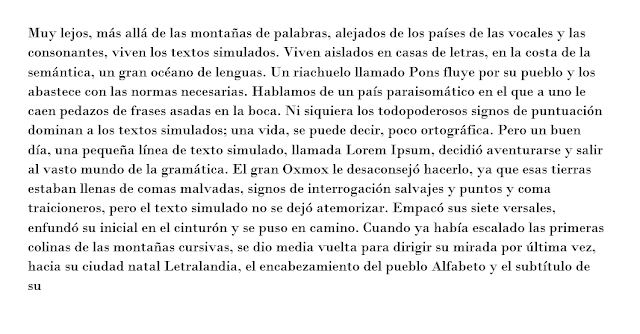
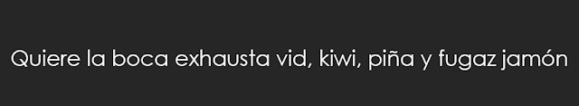
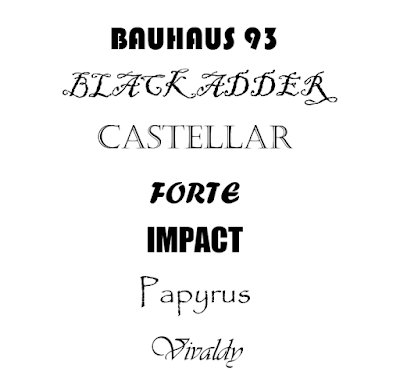
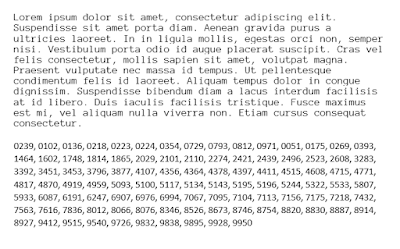
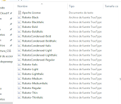

---
authors:
- admin
categories: [fuentes, Presentaciones, Recursos Educativos]
date: 2016-03-13T08:26:17+02:00
draft: false
featured: false
image:
  caption: "Photo by Marcus dePaula on Unsplash"
  focal_point: "Center"
projects: [ ]
subtitle: Cuál elegir y dónde encontrarlas 
title: "Fuentes tipográficas"
tags: [fuentes, Presentaciones, Recursos Educativos]
---

> Elegir la fuente adecuada puede arruinar o realzar cualquier documento

En esta entrada quiero repasar algunos aspectos básicos relativos a la elección de fuentes tipográficas.

Para elegir una fuente, debemos pensar primero en el tipo de documento que estamos generando: si va a leerse en pantalla o impreso, su extensión y la imagen que queremos transmitir. Por ejemplo, la fuente Comic Sans, inicialmente concebida para su uso en software infantil debería quedar desterrada de cualquier contexto profesional o que implique seriedad si no queremos convertirnos en un [Comic Sans Criminals](http://www.comicsanscriminal.com/).

Así pues vamos a repasar las distintas familias de fuentes y para qué debemos utilizarlas. En primer lugar, ¿qué es una familia de fuentes?

Existen cuatro grandes tipos de fuentes: **serif**, **sans-serif**, **display** y **monospace**.

### Fuentes Serif

> ###   Times y Times New Roman son fuentes clásicas 'serif'

 Las fuentes serif se denominan así porque tienen "serifa" que son esas pequeñas muescas de terminación de los caracteres. Esas terminaciones ayudan a identificar mejor los caracteres cuando la fuente es pequeña e impresa y facilitan por tanto una lectura más rápida y cómoda. En general, en un documento largo que se va a leer fundamentalmente **impreso** y en el que vamos a utilizar tamaños de fuente pequeños es preferible utilizar una fuente serif. Por ejemplo, en un **artículo académico** será siempre preferible utilizar este tipo de fuente.

#### Ejemplos de fuentes serif:

**Times New Roman** es todo un clásico, fue la fuente por defecto en muchas versiones de Microsoft Office y es una apuesta segura. Si queremos un documento sobrio y profesional, con esta fuente no nos equivocamos. Sin embargo, podemos optar por muchas otras alternativas: como Garamond, que fue creada en el sigo XVI, Bodoni, Georgia, o Latin Modern Roman. Veamos como quedan:

|  |
| ---------------------- |
| Garamond               |

|  |
| -------------------- |
| Bodoni               |

|  |
| --------------------- |
| Georgia               |

|  |
| ----------------------------- |
| Latin Modern Roman            |

Garamond, Bodoni y Georgia vienen preinstaladas en Microsoft Office, y Latin Modern Roman puede descargarse [aquí](http://www.fontsquirrel.com/fonts/Latin-Modern-Roman). Personalmente prefiero Georgia, aunque Latin Modern Roman da un aspecto muy similar a los documentos generados en [LaTeX .](https://www.latex-project.org/)

###  Fuentes Sans Serif

> ### Arial es una de las más conocidas fuentes sans serif

Las fuentes sans serif no tienen el adorno final de las letras y eso las hace "más limpias" y especialmente legibles en **pantalla**. Son las fuentes a utilizar si estamos preparando una **presentación** o en cualquier **proyecto web**. La fuente sans serif más conocida es Arial y también pertenece a esta familia la última fuente por defecto en Microsoft Office: Calibri.

#### Otras fuentes sans serif

Las fuentes sans serif son las que más han crecido en los últimos años debido a su adecuación para presentar en pantalla y las opciones son infinitas. Os voy a presentar solamente algunas que me gustan especialmente.

#### Fuentes preinstaladas en Windows

Tengo que pedir disculpas a los usuarios de Mac OS pero confieso mi ignorancia en cuanto a las fuentes que se utilizan en su sistema operativo. Con respecto a las fuentes preinstaladas en Windows, me gustan especialmente cinco, incluida la fuente por defecto Calibri:

|  |
| --------------------- |
| Calibri               |

|  |
| --------------------------- |
| Century Gothic              |

|  |
| ---------------------- |
| Franklin Gothic        |

|  |
| -------------------- |
| Tahoma               |

|  |
| --------------------- |
| Verdana               |

Yo, personalmente, me quedo con Franklin Gothic.

#### Otras fuentes

De entre las muchísimas opciones gratuitas disponibles, algunas que me gustan mucho son:

|  |
| ----------------- |
| DIN               |

[DIN ](http://www.fontsquirrel.com/fonts/osp-din)es una gran fuente en general pero sobre todo para números. Mi preferida para cifras sin discusión.

|  |
| ------------------ |
| Lato               |

|  |
| --------------------- |
| Lato Light            |

[Lato](http://www.fontsquirrel.com/fonts/lato?q[term]=Lato&q[search_check]=Y) es una familia de fuentes amplísima que está disponible con 18 estilos de grosor y cursivas. Es sobria y muy efectiva.

|  |
| ------------------------ |
| Montserrat               |

[Montserrat](http://www.fontsquirrel.com/fonts/montserrat?q[term]=montserrat&q[search_check]=Y) es una fuente divertida, que queda bien en encabezados o transparencias con poco texto pero que resulta pesada si se utiliza en párrafos más largos.

|  |
| --------------------- |
| Open Sans             |

[ Open Sans](http://www.fontsquirrel.com/fonts/open-sans?q[term]=open+sans&q[search_check]=Y) es una fuente de libre uso que se utiliza en muchísimas webs. Es clara, sencilla y no cansa. También tiene una versión "condensed" que queda muy bien en mayúsculas:

|  |
| ------------------------------- |
| Open Sans Condensed             |

Por último, pero no peor, para transparencias mi preferida es la familia Roboto que también tiene versión condensed y múltiples opciones de grosor. Tres ejemplos:

|  |      |
| -------------------- | ---- |
| Roboto Regular       |      |

|  |
| ----------------------------- |
| Roboto Condensed              |

|  |
| ------------------------- |
| Roboto Light              |

Roboto puede descargarse desde [aquí](http://www.fontsquirrel.com/fonts/roboto-2014?q[term]=roboto&q[search_check]=Y)

### Fuentes display y monospace

Las fuentes **display**, también llamadas decorativas, de exhibición o de fantasía son fuentes que nunca debemos utilizar como fuentes de texto de párrafo o de encabezado. Estas fuentes están pensadas para su uso en logotipos o grandes titulares, folletos o similares. Por ejemplo, en Windows algunas de estas fuentes son:

|           |
| ------------------------------ |
| Fuentes decorativas de Windows |

En [Creative Market](https://creativemarket.com/), por ejemplo, podemos encontrar cientos de fuentes de este tipo.

Las fuentes **monospace** son aquellas en las que todos los carácteres ocupan el mismo espacio. Por ello, son las fuentes más adecuadas cuando necesitamos que el texto en columnas quede perfectamente ordenado por ejemplo, para representar código informático o también para presentar números en tablas. La fuente monospace más conocida es Courier pero hay otras.

Por ejemplo, la fuente [Anonymous Pro](http://www.fontsquirrel.com/fonts/Anonymous-Pro) o la [Fira Mono](http://www.fontsquirrel.com/fonts/Anonymous-Pro), gratuitas, podrían hacer la misma función:

|  |
| ----------------------- |
| Anonymous Pro           |

|  |
| ---------------------- |
| Fira Mono              |

###  ¿Cómo utilizar fuentes que no están preinstaladas en el sistema?

Para terminar, vamos a comentar cómo podemos utilizar fuentes distintas a las originalmente instaladas. En primer lugar, es necesario saber para qué vamos a utilizar esa fuente: podemos necesitarlas para utilizarlas en nuestro paquete de office de escritorio, para una página web o un blog, para incrustarlas en documentos pdf que generemos o incluso para utilizarlas en aplicaciones o software. Tendremos que tener en cuenta estos usos para saber el tipo de licencia que necesitamos.

En [fonts.com ](http://www.fonts.com/)tenemos muchísimas fuentes con licencias de 500€ pero, si no somos diseñadores gráficos encontraremos todas las fuentes que necesitemos con licencia de libre uso en [Font Squirrel](http://www.fontsquirrel.com/).

#### Uso de otras fuentes en programas de escritorio

Una vez que elegimos la fuente en Font Squirrel, la descargamos y tendremos un archivo comprimido en zip.

Si descomprimimos el archivo, veremos distintos archivos uno para cada tipo de fuente: regular, negrita (bold), cursiva (italic) y otras posibles opciones en función de las opciones que existan para la familia seleccionada.

Hacemos doble click sobre cada uno de ellos y veremos un texto de muestra y una opción para instalar:

Después de usar la función "instalar" tendremos la nueva fuente en el listado que aparece en cualquier programa que utilicemos y podremos utilizarlas como cualquier otra fuente.

> **IMPORTANTE**: Si vamos a compartir estos archivos, tenemos que tener en cuenta que, si el destinatario no tiene las fuentes utilizadas instaladas, estas se sustituiran automáticamente por otras fuentes del sistema. Para que no suceda esto tenemos dos opciones distintas: guardar como pdf o, si queremos edición compartida utilizar la opción: *"incrustar fuentes en el documento"*:

 

#### Uso de fuentes en sitios web

En el caso de que vayamos a utilizar las fuentes en una web, podemos optar por subir los archivos necesarios a la carpeta raíz del sitio o simplemente enlazar las fuentes desde un servidor.

Si vamos a subir los archivos, tenemos que tener en cuenta el formato del archivo. Para asegurarnos de que los usuarios del sitio pueden  visualizar correctamente las fuentes, tendríamos que convertir la fuente seleccionada y después subir varias versiones distintas. [Font Squirrel](http://www.fontsquirrel.com/tools/webfont-generator) tiene también un generador que nos permite convertir las fuentes. 

Sin embargo, la opción más simple es enlazarlas directamente desde [Google Fonts](https://www.google.com/fonts).  Una vez hemos buscado la fuente y seleccionado los caracteres que nos interesan, si la fuente es de uso libre nos aparecen directamente los códigos que debemos copiar en el sitio web para utilizarla.

Espero que esta revisión os haya resultado útil. ¿Y vosotros, utilizáis fuentes por defecto?¿os gusta la comic sans ;) ? ¿Cuál es vuestra fuente preferida? 