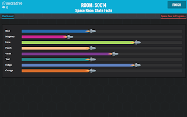
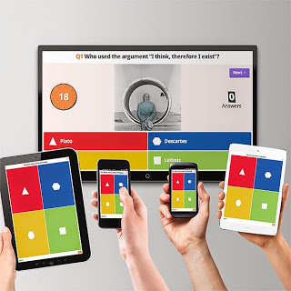

---
authors:
- admin
categories: [Docencia, Herramientas 2.0, Recursos Educativos, ]
date: 2015-05-30T08:26:17+02:00
draft: false
featured: false
image:
  caption: ""
  focal_point: ""
projects: []
subtitle: Test en directo
title: "Gamificación (2). Recursos para dinamizar la clase"
tags: [Docencia, Herramientas 2.0, Recursos Educativos, ]
---

Hoy quiero repasar dos herramientas estupendas para comprobar en tiempo real el progreso en la comprensión de los estudiantes y, al mismo tiempo, animar la participación en clase: [Socrative](http://www.socrative.com/) y [Kahoot](https://kahoot.it/#/)

### Si no puedes con tu enemigo, únete a él: dispositivos móviles en clase

Un comentario común entre mis compañeros es la omnipresencia de los smartphones durante las clases. Los estudiantes son incapaces de permanecer desconectados del "Whatsapp" durante una hora y retuercen el cuello para echarle un vistazo furtivo al teléfono escondido debajo de la mesa o en el bolsillo del abrigo. El uso de estas herramientas  u otras como la incorporación de [Twitter](https://twitter.com/) permite dar un uso más productivo al teléfono y aumenta la implicación de los estudiantes.

### ¿Alguien tiene algún ejemplo?...

Otro problema común en mi facultad es la falta de participación de los estudiantes en las clases. Aunque los grupos se han reducido, salvo en asignaturas de cursos avanzados, la participación en clase suele ser muy baja y las preguntas abiertas suelen quedar sin respuesta. Normalmente, esta dinámica es muy difícil de cambiar y se retroalimenta así que, pasada la primera semana de clase, estimular la participación es cada vez más complicado. Las respuestas a través del móvil resultan menos comprometidas para los estudiantes y se animan más. Normalmente, al visualizar en pantalla los resultados de las votaciones es más fácil que después se produzca una discusión oral y la participación en los grupos en los que los he utilizado aumenta muchísimo.

### ¿Habéis entendido esto?

En mi opinión, el mayor potencial de estas herramientas está en su capacidad de monitorizar en tiempo real el aprendizaje de los estudiantes. Con un test en vivo, podemos detectar rápidamente qué conceptos se han comprendido bien y cuales no, de manera que podemos pasar rápidamente sobre los primeros y profundizar en los otros. Nuestra experiencia como docentes nos hace poder tener un diagnóstico previo sobre qué aspectos son más complicados para los estudiantes pero la práctica me ha demostrado que no en todos los grupos los contenidos conflictivos son los mismos. Poder obviar una explicación adicional que sobra para un grupo de estudiantes reduce el aburrimiento y, a la inversa, repasar en el momento una explicación errónea ahorra mucho trabajo posterior.

### Socrative y Kahoot

Las dos plataformas tienen muchos puntos en común. Son totalmente **gratuitas** y **multidispositivo**, de manera que son accesibles a través de móviles, tablets o cualquier navegador web. El profesor se registra como educador, mientras que en el caso de los estudiantes no es necesario registrarse. Con la cuenta del profesor se crean los quiz, en los que podemos incluir preguntas de **respuesta múltiple**, preguntas de **verdadero o falso** o incluso **respuestas abiertas**. En el caso de [Socrative](http://www.socrative.com/) podemos descargar una **plantilla** en Excel, de manera que resulta cómodo crear los test y subirlos más tarde. En ambos casos podemos incluir **imágenes** en las preguntas. En [Kahoot](https://kahoot.it/#/) cada test tiene un PIN que proporcionaremos a los estudiantes en el momento de realizarlo. En [Socrative](http://www.socrative.com/) cada profesor tiene un "room number" en el que se inscriben los estudiantes. 

Con Socrative, podemos activar los test de manera que los estudiantes puedan hacerlos a su ritmo (pasando las preguntas adelante y atrás), al ritmo que marquemos nosotros como profesores o en el modo "carrera espacial", especialmente apreciado por los estudiantes, en el que los equipos van acumulando puntos en función de las respuestas correctas y el tiempo:

En Kahoot, el texto de las respuestas se muestra solamente en pantalla y se marca el tiempo de manera que los estudiantes se centran más en la proyección , lo que  y se introduce un elemento de "tensión" adicional:

En ambos casos, los estudiantes reciben feedback inmediato sobre si han respondido o no correctamente. Socrative permite, según el caso, desactivar este feedback o incluir explicaciones adicionales sobre la respuesta correcta e incorrectas.

Aunque he utilizado ambas herramientas de forma esporádica en distintas clases, el semestre pasado utilicé Socrative de forma continua en una asignatura de primero de grado. Al final de curso, les pasé a los estudiantes una pequeña encuesta sobre la herramienta con escalas de 5 puntos desde "totalmente de acuerdo" hasta "totalmente en desacuerdo". Estos fueron los resultados:

<a href="https://infogram.com/uso_de_socrative_en_el_aula" style="color:#989898!important;text-decoration:none!important;" target="_blank">Uso de Socrative en el aula</a> <a href="https://infogram.com" style="color:#989898!important;text-decoration:none!important;" target="_blank" rel="nofollow">Infogram</a>

