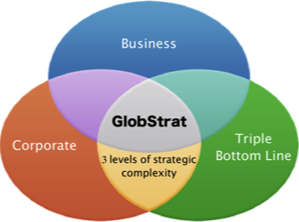

---
authors:
- admin
categories: [Docencia, gamificación, globstrat, Herramientas 2.0, Marketing, marketplace, markstrat, quantum, Recursos Educativos, simuladores]
date: 2015-04-18T08:26:17+02:00
draft: false
featured: false
image:
  caption: "Photo by Hermes Rivera on Unsplash"
  focal_point: "Center"
projects: []
subtitle: Gamificar la docencia de marketing
title: "Gamificación: Simuladores de empresa. ¡3, 2, 1 Fight!"
tags: [Docencia, gamificación, globstrat, Herramientas 2.0, Marketing, marketplace, markstrat, quantum, Recursos Educativos, simuladores]
---

## Gamificación

En los últimos tiempos se está imponiendo un nuevo "palabro": gamificación, entendida como la utilización de técnicas propias del juego lúdico para el aprendizaje en entornos profesionales. 

Las ventajas de la gamificación tienen que ver con la mayor motivación de los participantes, al aumentar el interés en una actividad a priori aburrida.

El objetivo de esta entrada no es discutir en detalle las ventajas e inconvenientes de esta aproximación al aprendizaje, sino describir una de las herramientas más populares en las Facultades de Economía y Empresa que pueden enmarcarse en esta tendencia. los simuladores de empresa y de marketing.

## Simuladores empresariales

Los simuladores de empresa tienen muchos años de vida. En mi facultad, se vienen utilizando con éxito desde hace 20 años y durante este tiempo hemos podido contrastar su utilidad. 

En este tipo de simuladores, se presenta a los estudiantes un mercado o industria determinado en el que existen varias empresas. Los estudiantes gestionan una de estas empresas y toman decisiones sobre distintos aspectos del negocio pudiendo observar los resultados de estas decisiones a lo largo de varios periodos.

### Ventajas de la utilización de simuladores

La introducción de estas técnicas en el aula proporciona distintas ventajas:

- La utilización de herramientas informáticas **similares a los videojuegos** siempre resulta atractiva para los estudiantes por lo que se muestran predispuestos a participar con mayor motivación.
- Los simuladores son **competitivos** por definición. Los estudiantes pueden competir con máquinas, con estudiantes de otros centros o con los propios compañeros de clase. Especialmente en el último caso, este elemento competitivo multiplica la motivación y hace que se muestren mucho más involucrados.
- Dejando a un lado la motivación, introducen en el aula aspectos relativos al **riesgo** y la **incertidumbre** que son difíciles de transmitir en otros formatos. Como decía en el [blog del MUDE](http://mudeupna.blogspot.com.es/2015/02/simuladores.html), en las materias tradicionales, hay relativamente poca incertidumbre. Los estudiantes saben que si estudian mucho y preparan bien un examen es muy probable que saquen una nota alta. Además, en un examen normalmente hay respuestas claramente correctas y respuestas incorrectas. En un simulador, al igual que en la vida real, los resultados que se obtienen dependen, no solo de las acciones propias, sino también las de los demás. Los estudiantes se ven forzados a trabajar bajo escenarios de previsiones distintos y a prever las posibilidades de ocurrencia de cada uno.
- Específicamente en el campo del marketing y la empresa, los simuladores son especialmente útiles para mostrar la **interrelación entre las distintas áreas de negocio**. El diseño de los planes de estudios hace que, muchas veces los estudiantes perciban las materias como parcelas cerradas autoconclusivas. Las simulaciones hacen que comprendan mejor que, por ejemplo, es imposible tomar decisiones de marketing sin controlar sus implicaciones financieras.

## ¿Qué simulador?

Existen multitud de simuladores que podemos utilizar. No es mi propósito en esta entrada describir todos ellos, sino solamente destacar algunas características que, en mi opinión, destacan en aquellos con los que personalmente he tenido experiencia docente. En los últimos años, he utilizado en distintas clases cuatro simuladores: [Markstrat](http://web.stratxsimulations.com/simulation/strategic-marketing-simulation/), [Globstrat](http://globstrat-academy.com/), [MarketPlace ](http://ilsworld.com/)y [Quantum](http://quantrack.net/simuladorquantum.htm). 

Dos de ellos, Globstrat y Marketplace, tienen un enfoque de estrategia general, mientras que Markstrat y Quantum de centran más en la estrategia de marketing.

Veamos algunos detalles más:

### Markstrat

[Markstrat](http://web.stratxsimulations.com/simulation/strategic-marketing-simulation/) es uno de los simuladores con más solera. Nacido en INSEAD hace más de treinta años, durante este tiempo ha evolucionado incorporando todas las capacidades que permite la web sin cambiar su esencia inicial. Es sencillo pero potente, especialmente adecuado para cursos de marketing estratégico y para tratar los conceptos de segmentación y posicionamiento. 

En los últimos años, han desarrollado una herramienta Live, que permite el acceso a los estudiantes a través de un navegador web de forma muy atractiva y además es útil para el profesorado, ya que no es necesario ocuparse de ningún aspecto relativo a la simulación como tal, sino ocuparse del diagnóstico del desempeño de los estudiantes. 

### Marketplace

[MarketPlace ](http://ilsworld.com/) es una simulación de Interactive Learning Solutions que destaca por ser sumamente flexible a la hora de acomodarse a distintos cursos y enfoques. Es muy personalizable en cuanto a las decisiones a incluir. Esto permite que pueda ser útil en cursos básicos de empresa y cursos avanzados de estrategia. También destaca por ser una de las más detalladas en aspectos relativos a Comercio Internacional y Dirección de Operaciones. Al igual que Markstrat, funciona completamente en entorno web, con claves de acceso distintas para estudiantes e instructores.

### Globstrat

[Globstrat](http://globstrat-academy.com/) es otro simulador web, enfocado a cursos de dirección estratégica muy adecuado para tratar temas de Cuadro de Mando Integral y Triple Línea de Base. Tiene un atractivo visual menor que los dos anteriores, pero sin embargo, permite es especialmente adecuada para tratar los aspectos de riesgo e incertidumbre que mencionaba al principio de la entrada. La información que se proporciona a los participantes es aparentemente sencilla, pero pronto, estos participantes descubren que tiene implicaciones mayores de las esperadas. Las herramientas de diagnóstico para el intructor también están muy bien desarrolladas.

### Quantum

En nuestras clases de grado, actualmente estamos utilizando [Quantum](http://quantrack.net/simuladorquantum.htm), creado en España por compañeros de la [UC3M](http://www.uc3m.es/Inicio). Quantum funciona con instalación de software, de manera que instructores y participantes acceden a la simulación desde sus respectivos programas. En Quantum, distintos equipos compiten por hacerse un hueco en un mercado de emergente para un nuevo producto tecnológico. Entre los puntos fuertes del simulador, están los aspectos referidos al marketing estratégico y la profundidad de la información que se proporciona a los participantes, por lo que también es útil para repasar aspectos relativos a Investigación de Mercados. Además, a diferencia de las demás opciones, que cobran licencias individuales por participante, Quantum tiene un esquema de licencias fijas para un curso o semestre, por lo que es mucho más económico en el caso de grupos de estudiantes numerosos. 

  