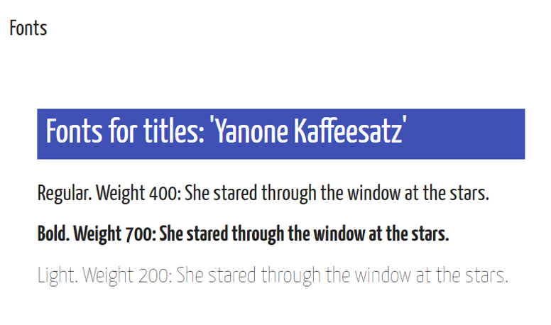
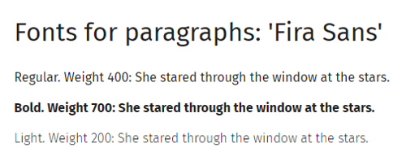
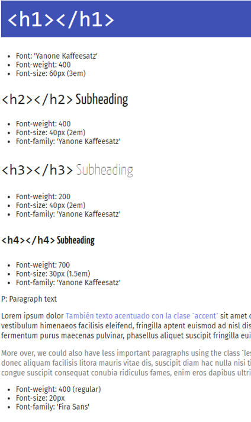
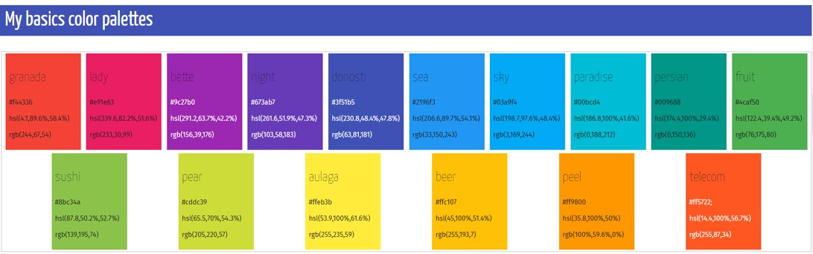
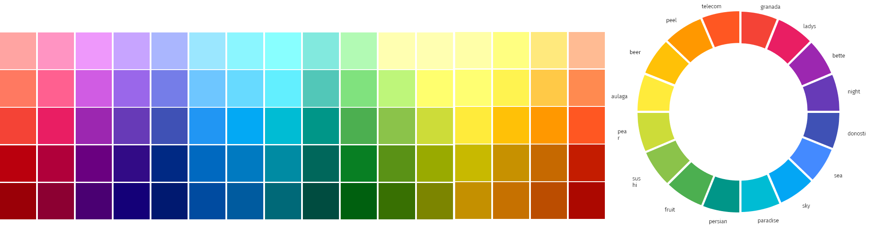

---
authors:
- admin
categories: [Presentaciones, Investigación ]
date: 2019-07-26T08:26:17+02:00
draft: false
featured: false
image:
  caption: ""
  focal_point: "Center"
projects: [ ]
subtitle: Creando una guía personal
title: "Hoja de estilos web y power point"
tags: [Presentaciones, Power Point, Marketing, ]
---

Este verano me he decidido a preparar una hoja de estilos general para mis proyectos y presentaciones. Tener esta hoja de estilos actualizada hace más rápido poner en marcha un nuevo proyecto y elimina la necesidad de seleccionar plantilla, fuentes y colores cada vez que se empieza a trabajar en una nueva presentación.

En mi caso, he preparado la plantilla general en `html` y está disponible [en este enlace](http://mcortinas_styles_cheatsheet.updog.co/). A partir de esta plantilla en `html` puedo preparar el documento que corresponda ya sea una presentación `xaringan` o en Power Point.

## Fuentes

He seleccionado solamente dos tipos generales de fuentes, una para los títulos y otra para el texto de párrafos. La fuente de los títulos es  [Yanone Kaffeesatz](https://fonts.google.com/specimen/Yanone+Kaffeesatz), una fuente sans serif que es la fuente por defecto en las presentaciones html en el paquete `xaringan` de [Yihui Xie](https://slides.yihui.name/xaringan/).

Durante este último año he utilizado esta tipografía en los títulos y tiene muy buena legibilidad en tamaño grande además de tener un toque decorativo que funciona bien en presentaciones sobrias en el diseño de fondos. 

Para el texto del documento es importante elegir una fuente que se lea bien en tamaño más reducido y que tenga variedades de peso (cursiva, negrita, light...). He elegido también una fuente sans serif ya que el uso principal va a ser en presentaciones. Dos buenas candidatas aquí pueden ser Open Sans y Roboto, de gran utilización en todo tipo de proyectos web. En mi caso, he optado por [Fira Sans](https://fonts.google.com/specimen/Fira+Sans) que tiene también buena legibilidad pero con un poco más de fantasía en algunos caracteres como la **g** que van bien con la fuente de los títulos.

## Párrafos

Además de seleccionar las fuentes, es importante definir de forma consistente el estilo de los distintos párrafos, ya que es la uniformidad en los estilos la que hace un documento se perciba como armonioso y profesional. En este caso, he definido cuatro niveles de títulos, combinando distintos pesos y tamaños de la fuente de títulos y dos colores distintos de párrafos para texto de más o menos importancia.

## Colores

La cuestión más complicada ha sido la relativa a los colores. No podría calcular el tiempo que he perdido en total eligiendo paletas de colores para un determinado gráfico, un documento, presentaciones... Me cuesta mucho elegirlos porque me gustan todos y siempre me parece llegar a una decisión "óptima" que pasa a ser subóptima en los siguientes 10 minutos. Tratando de prevenir este efecto, he buscado tener una paleta lo más amplia posible, que puede utilizar en distintas combinaciones para distintos proyectos (un tema de investigación, una asignatura...). Además, me parece interesante que estuviese suficientemente contrastada como para asegurarse de que se ve bien en todo tipo de pantallas (¡y que sea yo la única persona a la que le parece atractiva!) y, sobre todo, que sea accesible en la medida de lo posible para personas con algún tipo de discapacidad visual.  Mi idea es tener una paleta de colores amplia que pueda usar en combinaciones de dos o tres para una determinada presentación y con combinaciones más amplias para los elementos gráficos e infográficos . 

La paleta elegida han sido los colores del denominado [Material Design](https://material.io/design/), la guía de estilo que presentó Google en 2014 para el desarrollo de aplicaciones y proyectos web. En esta guía de estilo se definen las fuentes, la disposición de elementos en la pantalla, colores, botones, etc... La paleta de colores está disponible en [https://www.materialpalette.com/](https://www.materialpalette.com/).

Con esos colores básicos, ya podemos desarrollar una rueda completa, utilizando combinaciones más oscuras y claras. Para ello, es importante seleccionar nombres para cada color, que después podamos usar en combinación con sus descriptivos como "granada", "granada lighter", "granada darker". En este proceso me ha resultado muy útil la información en la página [viget.com]([https://www.viget.com](https://www.viget.com/)), más específicamente en los post sobre [adding colors][https://www.viget.com/articles/add-colors-to-your-palette-with-color-mixing/], [naming colors](https://www.viget.com/articles/add-colors-to-your-palette-with-color-mixing/), [tints, tones and shades](https://www.viget.com/articles/tints-tones-shades/) y [contraste de color](https://www.viget.com/articles/color-contrast/).

La paleta completa queda así:

## Plantilla en power point

Una vez que tenemos la plantilla web, es bueno también tener una "traducción" de esa plantilla en power point para poder utilizarla en estos proyectos. Por ejemplo, yo suelo utilizar RStudio para mis presentaciones, pero para los elementos infográficos muchas veces creo las imágenes en power point, las guardo en formato `.png` o `.jpg` y las incluyo en la presentación.

Para incorporar la plantilla anterior en una plantilla en power point es necesario seguir los siguientes pasos:

- Descargar las fuentes desde la página de Google Fonts para poder utilizarlas en el propio equipo
- Crear una nueva presentación de PowerPoint y, utilizando la vista "Patrón de Dispositivas", establecer esas fuentes por defecto.
- Para los colores, dado que en las paletas que he utilizado se definen en formato hexadecimal, primero hay que "traducirlos" a formato `rgb()` que es el que se utiliza en PowerPoint. Para ello, existen multitud de páginas, por ejemplo [https://www.colorhexa.com](https://www.colorhexa.com/f44336)
- Crear la paleta con las formas para que podamos copiar el formato y pegarlo rápidamente aplicado a la forma que nos interese.
- Opcionalmente, en el menú de diseño podemos introducir los colores para crear la paleta personalizada, aunque el proceso es lento porque de nuevo tenemos que introducir los tres valores `rgb` para cada color.

Por si a alguien le puede resultar útil, os dejo mi [plantilla en Google Drive](https://drive.google.com/file/d/1AjVbCoBDSCuFPwHZRgDaV6bdzTfTzbUY/view?usp=sharing). La plantilla `html` se puede copiar con la opción `ver código fuente` que aparece en con el botón derecho del ratón desde el navegador.

