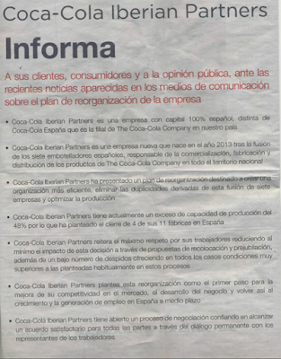
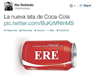
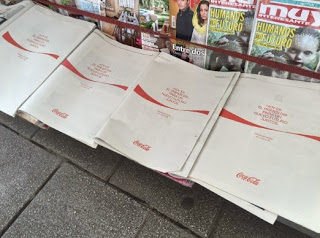

---
authors:
- admin
categories: [Marketing, ]
date: 2015-05-15T08:26:17+02:00
draft: false
featured: false
image:
  caption: " "
  focal_point: "Center"
projects: []
subtitle: El caso Coca Cola España
title: "Imagen de marca, posicionamiento social y RSC"
tags: [Marketing, ]
---

### Finales de año. 2013

Coca Cola es la tercera marca más valiosa del mundo y **la marca de la felicidad**.  Sin embargo, un terremoto está a punto de sacudir su imagen en España. El [9 de diciembre de 2013](http://www.elperiodico.com/es/noticias/economia/embotelladora-coca-cola-plantea-una-reestructuracion-que-afectara-1200-empleados-2909669), Coca-Cola Iberian Partners, que agrupa a las siete embotelladoras de la marca en España, anuncia un ERE que afectaría a 1.200 empleados. La repercusión en medios de comunicación fue inmediata y al mismo tiempo, comenzaron las movilizaciones de trabajadores. Para tratar de contrarestar este efecto, Coca Cola Iberian Partners lanza un comunicado de prensa a toda página en los principales medios, en el que **se desvincula** de The Coca-Cola Company:



Sin embargo, estas explicaciones no son suficientes para la opinión pública y rápidamente aparecen las primeras llamadas al **boicot** a la marca, mientras que algunos **directivos** aficionados a [apagar el fuego con gasolina](http://economia.elpais.com/economia/2014/04/03/actualidad/1396555027_247487.html) no contribuyen a calmar los ánimos.



La **estrategia de comunicación** de la marca fue la más sensata en estas circunstancias: reducir al mínimo la presencia en los medios y mantener un perfil bajo. Durante el resto del año, no se emitio en televisión ninguna nueva campaña y la presencia en el resto de medios fue mínima.

Las **consecuencias** de la situación, sin embargo, son demoledoras en el mercado y se estima que[ la marca pierde un 50% de sus ventas en la zona centro](http://economia.elpais.com/economia/2014/06/18/actualidad/1403079450_261813.html).


### Diciembre 2014

A finales de 2014, Coca Cola se lanza al contrataque con el ánimo de recuperar posiciones y con la campaña *"Desde siempre, mucho más que un refresco"* en la que se **recalcan los valores sociales de la marca:**


```{r echo=FALSE}
blogdown::shortcode('youtube', 'DLRpROLC6wc')
```

### Abril 2015


Por desgracia para Coca Cola, la última palabra sobre este tema no estaba dicha y [el 15 de abril de 2015](http://www.elmundo.es/economia/2015/04/15/552e3ea3268e3eb7158b456f.html), el Tribunal Supremo declara la nulidad de los despidos y las redes sociales vuelven a incendiarse. Esta vez, la marca opta de nuevo por la presencia en medios escritos, pero en lugar de utilizar el formato "comunicado" lanza directamente un mensaje:

> Hoy es el primer día para un nuevo futuro juntos. Gracias por confiar en Coca Cola.



La empresa afirma que [pretende poner punto y final a la crisis e iniciar una nueva fase](http://cincodias.com/cincodias/2015/04/15/empresas/1429087632_907339.html) ¿Pero, es suficiente con que la marca proponga pasar página para que lo hagan también sus consumidores?

### ¿Ha sido buena la estrategia de comunicación de Coca Cola durante la crisis?

Es evidente que la imagen de Coca Cola ha sufrido mucho durante este tiempo y que su estrategia de comunicación no ha sido efectiva contrarestando los efectos negativos. Ahora bien, ¿la estrategia de comunicación ha sido mala? En mi opinión, **no había muchas alternativas**. ¿Dónde ha estado el **error**? [En febrero de 2014](http://www.elmundo.es/economia/2014/02/17/53020bbde2704ebb668b4570.html) el presidente de Coca Cola España declaraba:

> No es mi empresa y no es mi ERE

Efectivamente, CocaCola Iberian Partners  no es su empresa pero **sí es su marca** y la marca es el corazón y el gran intangible de The Coca Cola Company (más de 80.000 millones de dólares según [Interbrand 2014](http://www.bestglobalbrands.com/2014/ranking/)). Considerar la gestión de la marca como un tema puramente de marketing o comunicación que puede llevarse de manera independiente de otros aspectos como la gestión de la cadena de valor o la política de recursos humanos puede tener consecuencias graves para el principal activo de la empresa.


