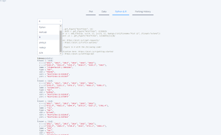

---
authors:
- admin
categories: [Herramientas 2.0, Investigación, Presentaciones, Recursos Educativos, Reveal.js]
date: 2018-03-28T01:26:17+02:00
draft: false
featured: false
image:
  caption: ""
  focal_point: "Center"
projects: []
subtitle: Ggplot y Plotly
title: "Gráficos Interactivos: dando vida a los números"
tags: [Herramientas 2.0, Investigación, Presentaciones, Recursos Educativos, Reveal.js]
---

Hoy vamos a hablar de algunas herramientas muy útiles para mejorar la visualización de datos. En otros post hemos hablado de [herramientas de creación de recursos visuales](https://mcrecursosdocentes.blogspot.com.es/2015/04/recursos-visuales-2-nuestro-propio.html) como [infogram](https://infogram.com/app/#/library) y [canva](https://www.canva.com/es_es/). Sin embargo, estos recursos son limitados en cuanto a su potencial para trabajar con bases de datos de cierta complejidad. Hoy quiero presentaros algunas herramientas muy potentes para hacer todo tipo de gráficos animados.

### Gráficos Animados con [plot.ly](https://plot.ly/online-chart-maker/)

Plot.ly es una herramienta impresionante para hacer gráficos ya que desde una interfaz visual sin necesidad de programar código, podemos crear gráficos espectaculares. En plot.ly, podemos crear una cuenta gratuita que nos permite el acceso a un panel como el que veis en la imagen.

En este panel podemos subir datos desde un formato Excel o csv y a partir de ahí empezar a elaborar nuestro gráfico. Para ello, tenemos que seleccionar el tipo de gráfico, entre 22 opciones distintas. Además, podemos seleccionar distintos gráficos para series diferentes y combinarlos en un mismo gráfico. Por ejemplo, cambiando las opciones para el caso de "otros sectores" podríamos tener algo así:

Podéis comprobar que estos gráficos tienen bastantes elementos interactivos, entre otras:

- Aparecen y desparecen los datos al pasar el ratón por encima
- Podemos ocultar o presentar las series al hacer click sobre ellas y los ejes se ajustan a los datos restantes
- Podemos hacer zoom en determinada área para ver en detalle algunos datos
- Podemos descargar una determinada vista en formato png

En el siguiente marco podemos ver un ejemplo para los resultados de un análisis cluster:

<iframe frameborder="0" height="500" scrolling="no" src="//plot.ly/~jtelszasz/230.embed" width="500"></iframe> 

#### Cómo integrar un gráfico creado en plot.ly

Bueno, ya tenemos nuestro gráfico ¿y ahora qué?

Para utilizarlo, tenemos varias opciones. Si queremos usarlo en un documento que va a distribuirse impreso, tendremos que exportarlo a un formato que podemos incrustrar, aunque obviamente en este caso perderemos las opciones de interactividad. Plot.ly permite exportar en formato .png, .pdf, .svg y .eps con lo que tenemos opciones suficientes sea cual sea el editor que utilicemos.

Si queremos utilizarlo en una presentación, tenemos dos alternativas: incluir en la presentación un link que abra el gráfico en un navegador web o incrustarlo en la propia presentación. En el caso de que utilicemos un software estilo [Power Point ](http://mcrecursosdocentes.blogspot.com.es/2015/04/muerte-por-powerpoint.html)siempre tendremos que incluir el link, mientras que si utilizamos software de presentación en [html ](http://mcrecursosdocentes.blogspot.com.es/2015/04/presentaciones-en-html-con-revealjs.html) podemos utilizar cualquiera de las dos opciones.

Para poder acceder al gráfico desde el navegador, el gráfico debe estar alojado en algún sitio. El propio plot.ly nos ofrece almacenamiento gratuito aunque, eso sí, los gráficos deben configurarse como públicos. Otra opción es descargar el archivo completo en html y subirlo a un espacio web propio.

Por último, podemos utilizar estos gráficos para integrarlos en un espacio web de cualquier tipo, como este blog. Para eso, utilizaremos la opción "embed" y simplemente pegaremos el código dentro del editor html de nuestro sitio.

Plot.ly tiene además de todo esto dos cosas extra que son geniales:

#### Modificando gráficos ya creados con plot.ly

Aunque el menú contextual es bastante intuitivo, las tremendas posibilidades de plot.ly hacen que a veces sea difícil construir desde cero un determinado gráfico. Lo bueno de esta herramienta es que nos permite navegar por la librería de gráficos públicos, coger uno determinado, copiarlo a nuestra biblioteca y a partir de ahí cargar nuestros propios datos.

Para el ejemplo del cluster que tenemos ahí, podemos utilizar la opción "fork" y tendríamos el gráfico con sus datos originales listo para poder modificarlo. En el caso de este cluster, hay dos gráficos superpuestos, uno con las puntuaciones de los distintos puntos y otro con los centros de cada grupo.

#### Editando los gráficos desde R (o Python, o javascript)

El acceso gratuito a la interfaz web de plotly no permite guardar los gráficos de forma privada. Sin embargo, existen librerías de plot.ly totalmente gratuitas con las que podemos crear, editar y guardar todo tipo de gráfictos plotly desde R u otros lenguajes como Python. Si, como es mi caso, trabajáis normalmente con R en vuestros proyectos de investigación, la integración es perfecta.

Simplemente tenemos que ir a la ventana de "View" en el gráfico, seleccionar la opción "Phyton & R" y obtenemos el código, listo para editarlo de nuestra forma preferida.

### Otras opciones: librerías para gráficos en Javascript

Además de plot.ly existen otras muy buenas opciones para crear gráficos interactivos. Por ejemplo, [Highcharts](https://www.highcharts.com/) es una muy buena alternativa, de uso libre para proyectos no comerciales y que tiene la ventaja de tener también un [editor online](https://www.highcharts.com/products/highcharts-editor/) muy útil para crear gráficos sin tener que programarlos. Otras opciones interesantes son [Chartist](http://gionkunz.github.io/chartist-js/index.html) y [D3](https://d3js.org/) aunque en este caso hay que configurar los gráficos directamente en javascript.

¿Qué os parecido la entrada?¿Pensáis que estas herramientas son útiles? 