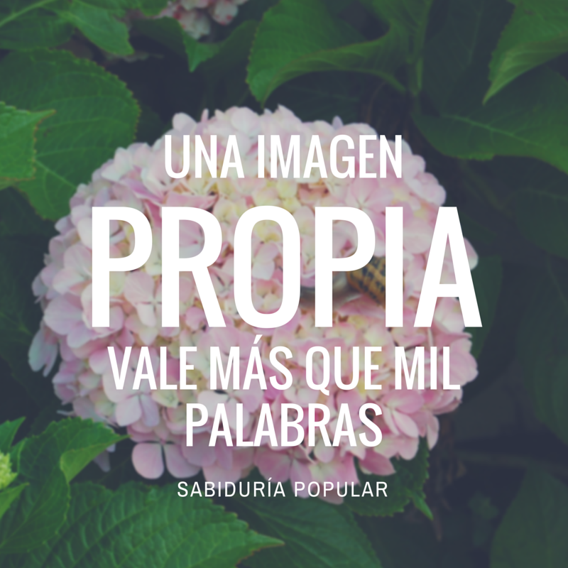

---
authors:
- admin
categories: [Blogs, Herramientas 2.0, Presentaciones]
date: 2017-05-15T08:26:17+02:00
draft: false
featured: false
image:
  caption: "Photo by Steve Johnson on Unsplash"
  focal_point: "Center"
projects: []
subtitle:  Nuestro propio material. Imágenes, Gráficos, e Infográficos + ¡bonus final!
title: "Recursos para presentaciones y blogs (II) "
tags: [Blogs, Herramientas 2.0, Presentaciones]
---

En la [entrada anterior](https://mcrecursosdocentes.blogspot.com.es/2015/04/recursos-para-presentaciones-y-blogs-i.html) repasaba fuentes de imágenes que podemos utilizar y algunas herramientas básicas de edición.

En esta entrada vamos a ir un paso más allá, viendo cómo podemos crear exactamente el material que necesitamos ya sea incluir **texto e imagen**, hacer un **gráfico**, un **infográfico** o incluso... (bueno, la sorpresa para el final). Empecemos por las composiciones de texto e imagen.

### texto+imagen

Cuando queremos incorporar texto rápidamente a una imagen de forma que quede visualmente atractiva, no hay nada tan eficaz como [PABLO](https://buffer.com/pablo#)

Sin embargo, si buscamos más potencia, [Canva](https://www.canva.com/) es mi herramienta favorita. La imagen que abre esta entrada está editada en Canva.  Su utilización es totalmente gratuita si incluimos nuestras propias imágenes o parte de las imágenes de su banco y permite crear desde banners hasta posters con múltiples disposiciones.

[PicMonkey](https://www.picmonkey.com/), que mencionaba en la entrada anterior también es muy bueno en esto.

### Gráficos e Infográficos

[Piktochart](https://piktochart.com/) es la primera herramienta para gráficos que quiero mencionar. Piktochart no solo sirve para hacer gráficos, sino que tiene muchas más opciones, pero es especialmente adecuada para esta tarea:

 

Otra opción muy completa es [Visme](https://www.visme.co/). Visme permite además hacer presentaciones completas y la creación de banners y tiene la ventaja con respecto a piktochart de que nos permite generar código para contenido embebido con una cuenta gratuita.

Y dejo para el final la herramienta más popular y probablemente la más potente: [infogr.am](http://infogr.am/):

<iframe frameborder="0" height="869" scrolling="no" src="//e.infogr.am/graficos-07342957?src=embed" style="border: none;" width="550"></iframe> 

## Bonus: Mapas Conceptuales

Por último, pero no peor, quiero mencionar una herramienta especialmente adecuada para la preparación de materiales docentes. [Mindomo](https://www.mindomo.com/es/mindmap) permite crear Mapas Conceptuales interactivos. No es ni mucho menos la única herramienta para elaborar estos mapas, pero tiene características muy atractivas, como el hecho de poder editar simultáneamente los mapas con los estudiantes o el poder incluir todo tipo de material complementario como vídeos, imágenes y enlaces.

Pulsa en la imagen para ver el potencial de Mindomo en este resumen de las dos últimas entradas:

¿Te ha parecido útil este material?

